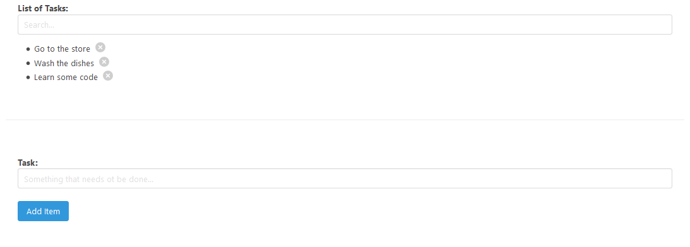

# To Do App in React.js

[](https://github.com/Jadhielv/search-tasks/blob/master/LICENSE)

[](https://twitter.com/intent/follow?screen_name=jadhielv)

## Getting Started

This project is a To-Do App in React.js using Parcel, Babel and Bulma

### How to Use

**Step 1:**

Download or clone this repo by using the link below:

```
https://github.com/Jadhielv/search-tasks.git
```

**Step 2:**

Go to project root and execute the following command in console to get the required dependencies: 

``` 
yarn or npm install
```

**Step 3:**

Run the project: 

``` 
yarn start or npm start
```

### Preview

<br/>

<div align="center">
    
</div>

## License
<!--- If you're not sure which open license to use see https://choosealicense.com/--->

This project uses the following license: [MIT](LICENSE)